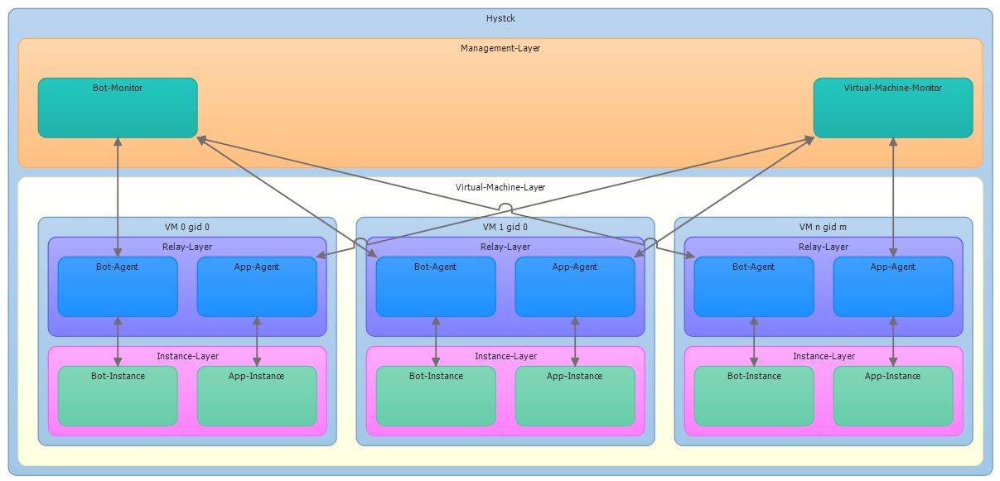

.. _architecture_index:

======================
Architecture of hystck
======================

In this part we shed some light on the architecture of hystck. Meaning we will show which tools are used inside the
framework such as what is used for virtualization, generating traffic, etc. However most importantly we will clarify
on where the different parts of the framework are running so that the installation process becomes more transparent.

First it is important to understand that hystck consists of two distinct parts. On one hand we have the user simulation
model that will be run on the physical machine. This part will communicate with an agent inside a virtual machine on the
other hand.

Framework architecture
#######################

Service VM
####################

Generator
####################

Reporter
#################
