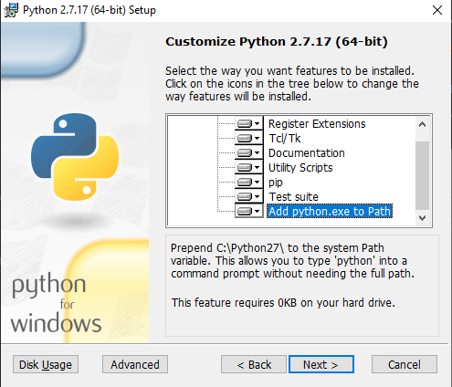

.. _guestinstall:

********************
Guest Installation
********************

Similarly to the installation of the host component described in :ref:`hostinstall`, the guest can be installed
both automatically via a set of scripts or manually. A major difference in the installation is the OS of the guest
component. While a similar approach to the host installation can be taken if Ubuntu is chosen as a guest platform,
an installation of a Windows 10 guest requires some additional work.

#################
Windows 10 Guest
#################

Prior to

Windows installation - automated
####################################

Windows installation - manual
#################################
...

Once the virtual machine can be run, you will need to download and install a few prerequisites before being able
to install python packages and hystck itself.

The first is Python 2.7 and can be found `here <https://www.python.org/ftp/python/2.7.17/python-2.7.17.amd64.msi>`_.
During installation, make sure Python is added to PATH and pip is installed alongside Python.

These options should be turned on by default. If needed, both options can be performed after the actual installation.

To add Python to your PATH,

.. TODO: add to path

If you need to install pip after the fact, download the `get-pip.py script here <https://bootstrap.pypa.io/get-pip.py>`_
and run the following command in your command line:

.. code-block:: console

    C:\Users\user\Downloads python get-pip.py

Furthermore, you will need to install the Visual C++ Compiler for Python 2.7. The compiler can be downloaded directly
from
`Microsoft's web presence <https://download.microsoft.com/download/7/9/6/796EF2E4-801B-4FC4-AB28-B59FBF6D907B/VCForPython27.msi>`_.

...

#################
Ubuntu Guest
#################

Ubuntu installation - automated
###################################

download hystck -> copy to desktop
->

Ubuntu installation - manual
###############################

