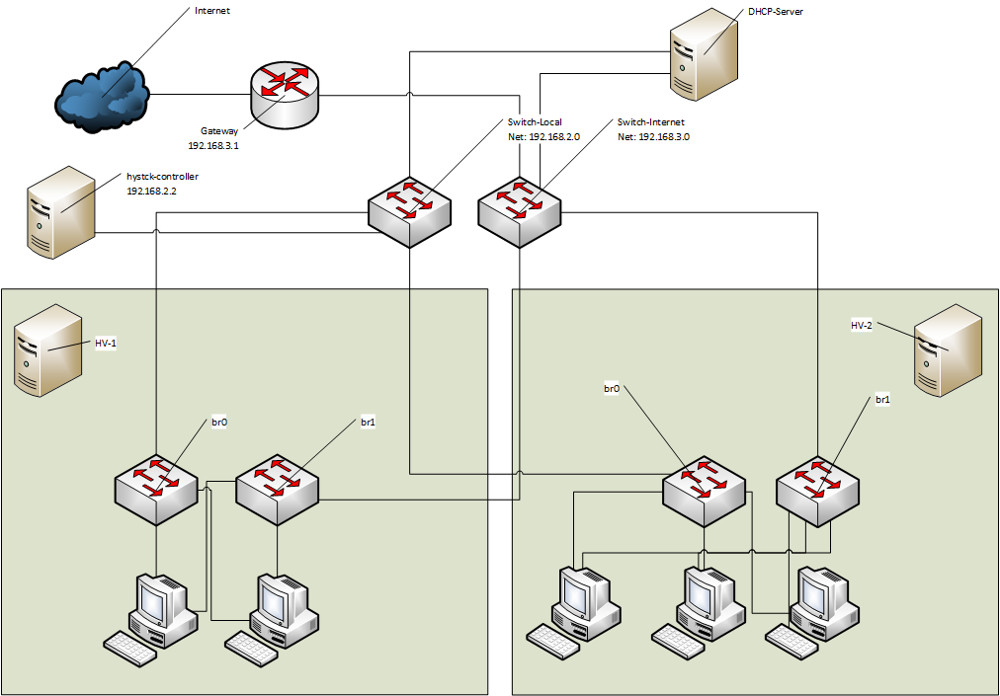

========================
Creation of the Networks
========================

Hystck relies on two types of networks. The local network will be used for framework configuration traffic, which should not be part of the sniffed traffic. Therefor the monitored traffic will be transfered through a second interface from now on called internet network.

Network Local
=============

The hystck-framework has to do some management stuff and therefor uses this network. All server with a hypervisor, which should be used by hystck have to be reachable through this network. One possibility is to create one bridge on every server with an interface eth0 attached to it. Where eth0 is the interface which is connected to all other servers.

::
	$ sudo brctl addbr br0
	$ sudo brctl addif br0 eth0

Network Internet
================

This network will only be used for the "real" traffic and has to have a internet-connection. This could also be done by a second bridge with an attached interface eth1. The interface eth1 is internet-ready.

::
	$ sudo brctl addbr br1
	$ sudo brctl addif br1 eth1

These kind of configuration is only non-permanent, for a permanent solution read the documentation about linux bridges for example from Ubuntu.

DHCP
====

Here comes a quick introduction to create a linux based dhcp server using dnsmasq, which will be handy if you have no existing DHCP-Server or keeping things separatly.

1. Create DHCP-VM:
::
	virt-install
	--name ubuntu_dhcp
	--ram 512
	--disk path=/var/lib/libvirt/images/ubuntu_dhcp.qcow2,bus=virtio,size=10,format=qcow2
	--cdrom ~/Downloads/ubuntu-14.04.3-desktop-amd64.iso
	--network bridge=br0
	--network bridge=br1
	--graphics vnc,listen=0.0.0.0
	--noautoconsole -v

2. Configure dnsmasq

Edit the configuration file accordingly:

::
	$ cat /etc/dnsmasq.conf

	...
	interface=eth0
	interface=eth1
	...
	dhcp-range=eth0,192.168.2.10-192.168.2.254,12h
	dhcp-range=eth1,192.168.3.10-192.168.3.254,12h
	...

	$ sudo ifconfig eth0 192.168.2.2
	$ sudo ifconfig eth1 192.168.3.2

	$ sudo service dnsmasq restart

Sample Network Layout
=====================

When you are done with the network configuration your simulation network may look like this:

Take a look at the hystck-controllers ip-address configuration.
All sample scripts expect the controllers ip-address to be static and with the address 192.168.2.2 .

In this sample layout we also decided to setup a separate dhcp-server.
You may put the dhcp-server on the hystck-controller as well if you don't want to use another machine for this.

Other things we did was to setup two hypervisor-servers with multiple VMs using the bridges br0 for management traffic and br1 for internet or simulation traffic.
We joined the interfaces on each hypervisor with a two hardware-switches (or use vnets on a managed switch) to join the internal networks of each VM.
The internet-switch has an additional connection with the gateway joining the external internet-cloud.
